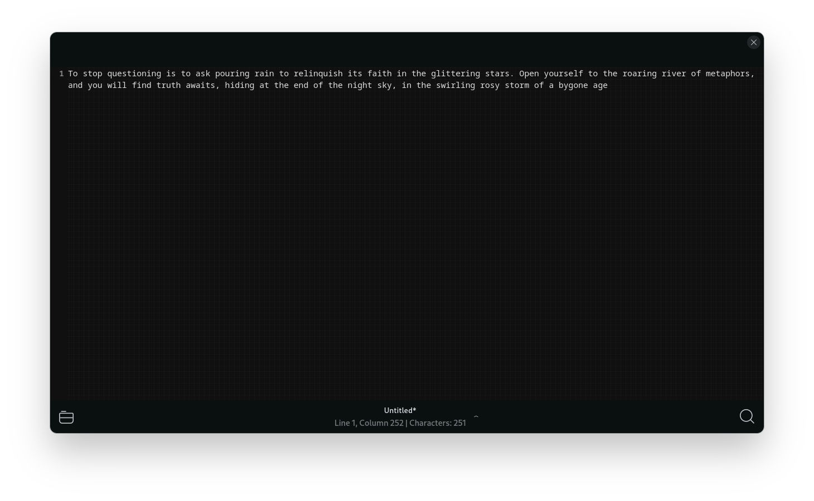

# Enigmata

the tauOS text editor

###
[](https://stopthemingmy.app)
[](http://www.gnu.org/licenses/gpl-3.0)


Enigmata is a text editor for the KIRI Desktop Environment. It's designed to be a simple, barebones text editor that can be used
for light text editing tasks, but still has some QoL features like syntax highlighting and search and replace.

If you're looking for a full-featured text editor, you might want to look elsewhere. Consider using [Zed](https://zed.dev) or [Visual Studio Code](https://code.visualstudio.com)
if you'd like a full-featured text editor.

It is written in Rust, and uses Helium + [Relm4](https://relm4.org), as its GUI framework.

It makes use of [GTKSourceView](https://gitlab.gnome.org/GNOME/gtksourceview/) for its text editor component.

Enigmata is a rewrite of the original [Enigma](https://github.com/tau-OS/enigma) text editor, which was written in Vala and had even less features than Enigmata.

## Features

- Syntax highlighting, theming, line number and other customization options via GTKSourceView
- Sleek, minimalistic UI based on the [Helium HIG](https://developer.fyralabs.com/helium/hig/design-principles)
- One window, one document interface. No tabs, just a window for each document
- Search and replace functionality, with regex, case sensitivity and whole word options available

## Building

To build Enigmata, you will need to have Rust installed. You can install Rust by following the instructions on the [official Rust website](https://www.rust-lang.org/tools/install).

Once you have Rust installed, you may download the additional dependencies by running:

```bash
sudo dnf install gtksourceview5-devel libhelium-devel gtk4-devel glib2-devel
```

Then, you can clone the repository and build the project by running:

```bash
git clone https://github.com/tau-OS/enigmata.git
cd enigmata
cargo build --release
```

The binary will be located at `target/release/enigmata`.

## License

Enigmata is licensed under the GNU General Public License v3.0. You can view the license [here](LICENSE).
